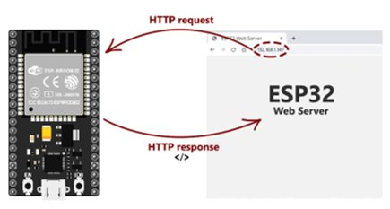
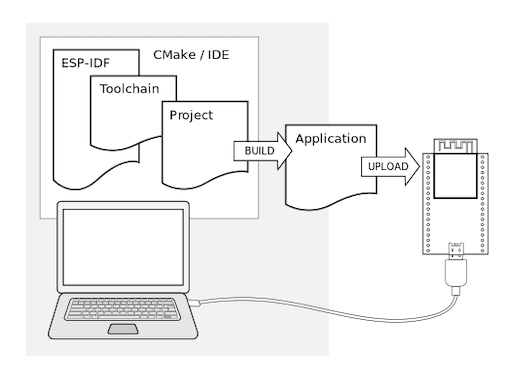
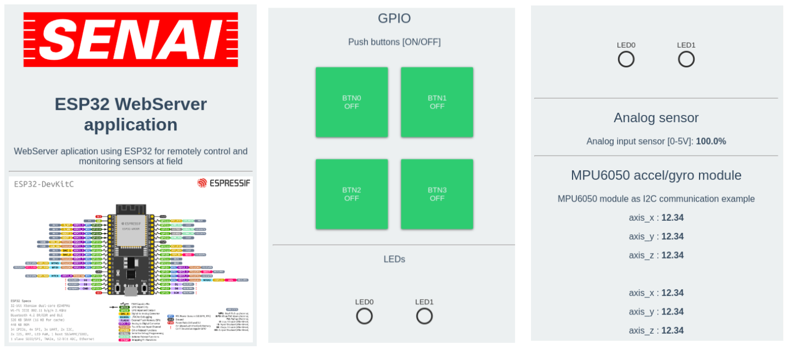

# ESP32 WebServer application

## WebServer aplication using ESP32 for remotely control and monitoring sensors at field

### Setup:

- Debian 12 linux native host
- IDE Clion v2023 with Espressif toolchain
- ESP-IDF v4.4 framework (C language) [Link] https://docs.espressif.com/projects/esp-idf/en/v4.4.6/esp32/index.html
- FreeRTOS

### Hardware:

- ESP32 WROOM-32 devkit
- Push-buttons
- LEDs
- ADC sensor (LDR)
- MPU6050 accel/gyro module (I2C)
- Protoboard

### Features:

- Webserver (HTML, CSS, JS)
- HTTP and websocket protocol
- Wifi connection as station and access point mode
- ADC sensor (LDR sensor)
- I2C communication (MPU6050)
- GPIOs (IRQ inputs and outputs)

## ESP-IDF v4.4

Installation according Espressif get-start documentation

[Link] https://docs.espressif.com/projects/esp-idf/en/v4.4.6/esp32/get-started/linux-setup.html

- Setup:

      $ mkdir -p ~/esp
      $ cd ~/esp
      $ git clone -b v4.4.6 --recursive https://github.com/espressif/esp-idf.git

- Enviroment:

      $ echo "alias get_idf='. $HOME/esp/esp-idf/export.sh'" >> $HOME/.bashrc
      $ export IDF_PATH=/home/daniel/esp/esp-idf
      $ export ESPPORT=/dev/ttyUSB0

- Useful commands:

      $ get_idf
      $ idf.py set-target esp32
      $ idf.py menuconfig
      $ idf.py -p /dev/ttyUSB0 clean build flash monitor

## TODO:

- [x] Implement GPIO with interruption with debounce treatment
- [x] Implement ADC sensor reading
- [x] Implement I2C (MPU6050 modules)
- [x] Implement Wifi Station and Access Point mode
- [x] Implement HTTP server
- [x] Implement Websocket server
- [x] Implement Timestamp with NTP time sync
- [x] Implement cJSON object create and parsing
- [x] Implement SPIFFS -> function to read index.html file direct from "disk"
- [ ] Implement mDNS
- [ ] Implement HTTPS (TLS)
- [ ] Implement Watchdog timer
- [ ] Implement UART connection
- [ ] Review MQTT, create html dashboard to configure it
- [ ] Review ADC and create html to sensors calibration feature

### Dashboard

